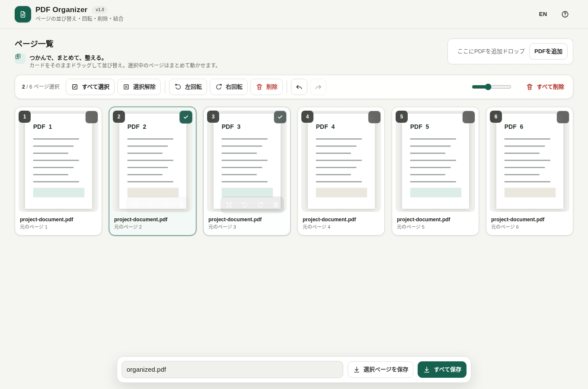

# PDF Organizer

[](https://github.com/ttomohisa/html-pdf-organizer/actions/workflows/deploy-pages.yml)
[](LICENSE)
[](https://ttomohisa.github.io/html-pdf-organizer/)

[English README](README.md)

PDFのページ整理を、ファイルを外部へアップロードせずブラウザ内だけで行える単一HTMLアプリです。

## 🚀 デモ

### [GitHub PagesでPDF Organizerを開く](https://ttomohisa.github.io/html-pdf-organizer/)

GitHub Pagesから最初のHTMLを読み込んだ後、PDFの読み込み・サムネイル生成・並び替え・回転・保存は端末内で処理されます。選択したPDFがサーバーへ送信されることはありません。

[](https://ttomohisa.github.io/html-pdf-organizer/)

## 主な機能

- カード全体をドラッグしてページを並び替え
- 複数選択したページを、重なったプレビュー付きでまとめて移動
- スマートフォンでは通常スワイプをスクロールとして優先し、短い長押し後のみドラッグ開始
- 画面端へドラッグしたときの高速自動スクロール
- 1ページまたは複数ページの回転・削除
- ダブルクリックまたは拡大ボタンによるページプレビュー
- 複数PDFのページを1つのPDFへ結合
- 全ページまたは選択ページだけを保存
- 元に戻す・やり直す
- 1つのHTML内で日本語・英語を切り替え
- PC・スマートフォン、ライト・ダークモード対応
- SVG faviconをHTML内に埋め込み
- PDF.js、pdf-lib、Worker、フォント、CMap、WASMなどをHTMLへ内包

## すぐに使う

アップロードは行われません。選択したファイルはブラウザセッション内にローカルに保存されます。

### Webで使う

[デモを開く](https://ttomohisa.github.io/html-pdf-organizer/)だけで利用できます。インストールやアカウント登録は不要です。

### ダウンロードして使う

[pdf-organizer.html](https://github.com/ttomohisa/html-pdf-organizer/blob/main/pdf-organizer.html) をリポジトリからダウンロードして、最新のChromiumベースのブラウザ（FirefoxまたはSafari）で開いてください。

### ビルドして使う(advance)

1. このリポジトリをダウンロードまたはクローンします。
2. Windowsで `build-offline.bat` をダブルクリックします。
3. 初回だけ、`versions.json` で固定された依存パッケージを取得します。
4. 生成された `dist/index.html` を任意の場所へコピーします。
5. 以降は `dist/index.html` 単体を、インターネット接続なしで開けます。

Python、Node.js、ローカルWebサーバーは不要です。Windows標準のPowerShellと `tar.exe` を使用します。

## 使い方

1. 1つ以上のPDFを追加します。
2. カードをドラッグしてページ順を変更します。
3. 複数ページを選択し、選択中のカードをドラッグするとまとめて移動できます。
4. スマートフォンではカードを短く長押ししてから動かします。通常の縦スワイプはページスクロールになります。
5. ツールバーまたはカード上のボタンから、回転・プレビュー・削除を行います。
6. 保存ファイル名を入力し、全ページまたは選択ページを保存します。

### ページ選択

- カードをクリックすると選択できます。
- 右上のチェックをクリックすると、現在の選択を残したまま追加・解除できます。
- `Ctrl` / `⌘` を押しながらクリックすると選択を追加・解除できます。
- `Shift` を押しながらクリックすると範囲選択できます。

### キーボード操作

| ショートカット | 操作 |
| --- | --- |
| `Ctrl` / `⌘` + `A` | すべてのページを選択 |
| `Ctrl` / `⌘` + `Z` | 元に戻す |
| `Ctrl` / `⌘` + `Shift` + `Z` | やり直す |
| `Delete` / `Backspace` | 選択ページを削除 |
| `Esc` | 選択解除またはプレビューを閉じる |
| `←` / `→` | プレビューの前後ページへ移動 |

## GitHub Pagesで公開する

このリポジトリには、完全内包版をビルドしてGitHub Pagesへ自動公開するワークフローが含まれています。

1. リポジトリ名を `html-pdf-organizer` としてGitHubへプッシュします。
2. **Settings → Pages → Build and deployment → Source** で **GitHub Actions** を選択します。
3. `main` ブランチへプッシュするか、Actions画面から **Deploy offline app to GitHub Pages** を手動実行します。
4. ビルド成功後、`https://ttomohisa.github.io/html-pdf-organizer/` で公開されます。

`main` へのプッシュ時には、固定バージョンの依存パッケージから `dist/index.html` を再生成し、外部ランタイム参照が残っていないことを検査してから公開します。

詳しい手順とトラブルシューティングは [GitHub Pages公開ガイド](docs/GITHUB_PAGES.ja.md) を確認してください。

## 開発とビルド

```text
.
├─ src/index.template.html       # アプリ本体のテンプレート
├─ versions.json                 # 依存バージョンと内包対象
├─ build-offline.bat             # Windows用ビルド入口
├─ build-offline.ps1             # 完全内包HTMLの生成処理
├─ dist/index.html               # ビルド後に生成される公開物
└─ .github/workflows/
   ├─ build-offline.yml          # Pull Request時のビルド検証
   └─ deploy-pages.yml           # mainからPagesへ自動公開
```

### 依存ライブラリを更新する

`versions.json` のバージョンとファイルパスを変更し、`build-offline.bat` を再実行します。

キャッシュを破棄して再取得する場合：

```bat
build-offline.bat -ForceDownload
```

ビルド処理は以下を自動で行います。

- npm公式レジストリから固定バージョンのtarballを取得
- 依存ファイルとPDF.jsサポートデータを単一HTMLへBase64内包
- 依存tarball、PDF.js本体、WorkerのSHA-256を記録
- 外部スクリプト参照や未置換プレースホルダーを検査
- PDF.jsのパッケージ構成に互換性のない変更がある場合は停止
- `dist/dependency-manifest.json` を生成

## プライバシーと通信防止

生成されたHTMLには以下が含まれます。

- `connect-src 'none'` を含むContent Security Policy
- Main ThreadとPDF.js Workerの外部 `fetch` 拒否
- HTML内データだけを返す仮想アセットローダー
- Blob URLから読み込むPDF.js本体、pdf-lib、Worker

GitHub Pages版ではページを開くためのHTML配信は発生しますが、読み込んだPDFの内容はアプリから外部へ送信されません。完全にネットワークを切って使う場合は、生成済みの `dist/index.html` をローカルで開いてください。

HTML内の `html-pdf-organizer.invalid` は仮想アセット識別用の内部キーであり、通信先ではありません。

## 制限事項

- パスワードで保護されたPDFには対応していません。
- 電子署名付きPDFを編集すると署名は無効になります。
- しおり、添付ファイル、フォーム、電子署名などの文書レベル情報が、保存後のPDFへ引き継がれない場合があります。
- ページ数や画像量が多いPDFでは、端末のメモリを多く使用します。
- 現在のUIでは、1ファイルあたり250MBを上限としています。

## 使用ライブラリ

| ライブラリ | バージョン | ライセンス | 用途 |
| --- | ---: | --- | --- |
| PDF.js | 6.2.108 | Apache-2.0 | PDF読み込み、サムネイル、プレビュー |
| pdf-lib | 1.17.1 | MIT | ページ複製、回転、PDF生成 |

ドラッグ処理は外部ライブラリを使わず、Pointer Eventsで実装しています。詳細は [THIRD_PARTY_NOTICES.md](THIRD_PARTY_NOTICES.md) を確認してください。

## コントリビューション

バグ報告や機能提案はIssueからお願いします。開発への参加方法は [CONTRIBUTING.md](CONTRIBUTING.md) を確認してください。

## ライセンス

Copyright © 2026 ttomohisa

このプロジェクトは [MIT License](LICENSE) で公開されています。
